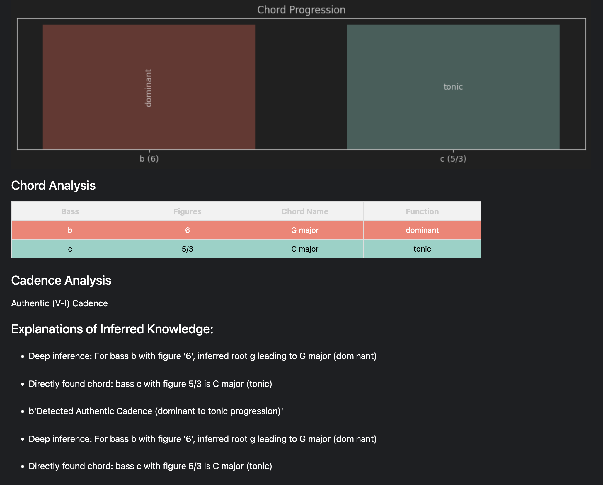

# Cadence Analysis
## A Stub Expert System in Prolog

---

This code demonstrates how an expert system for music analysis might work. The logic is written in SWI-Prolog, with a Python/Jupyter Notebook wrapper providing a simple UI.

The goal is to illustrate how Prolog might be used for analyzing simple chord progressions and cadence detection. It is not intended to be a practical tool for actual music analysis, but rather a demonstration of core principles.

---

## Structure

+ `cadence_expert.pl` -- Prolog file containing the Knowledge Base (KB), Inference Engine (IE), and core logic
  
+ `cadence_analyzer.ipynb` -- Jupyter Notebook frontend for user interaction and demo cases, communicating via PySWIP

---

## Functionality

### Prolog

+ Definition of chords and scale degree functions (KB)
+ Inversion and cadence detection (IE)
+ Explanation logging
+ Extension of the knowledge base
+ Elementary interactive console interface

### Notebook

+ Communication with Prolog
+ Visualization of analysis
+ Predefined demos

---

## Requirements

+ SWI-Prolog
+ Python 3 with `matplotlib`, `pandas`, and `pyswip`

---

## Sample Output

---

Most of the Prolog code was written after a seminar that I took in Computational Linguistics during the 1990s that touched expert systems (and included some fundamentals of Prolog and LISP). -- Further info and literature in the inline code comments.

christoph.hust@hmt-leipzig.de