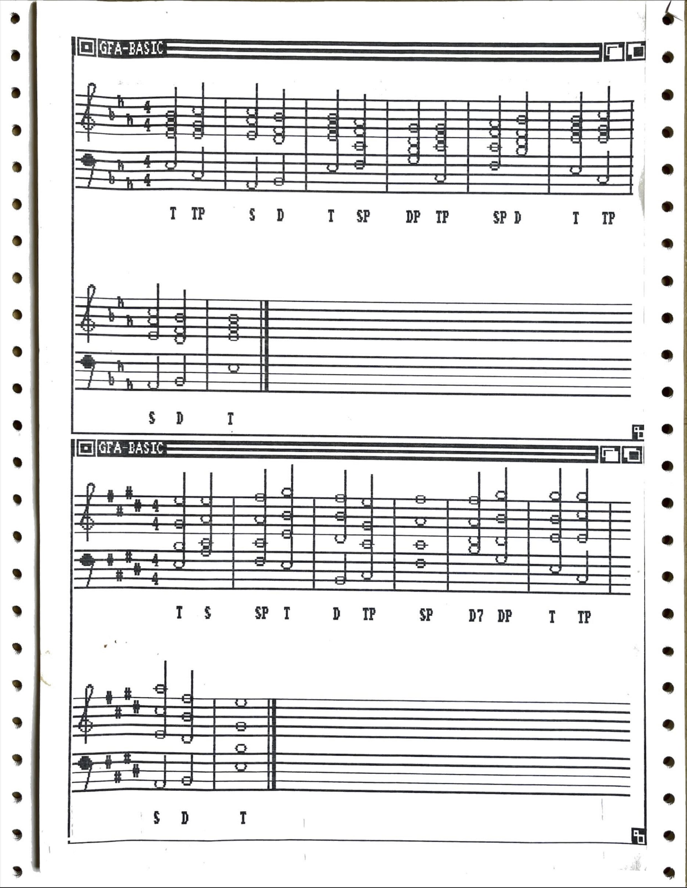

# Rule-Based Music Generation
## in GFA-BASIC

---

This code, written around 1989/90 in GFA-BASIC for Commodore AMIGA, is implementing an algorithm for elementary music generation. Users can input either thorough-bass or functional progressions, and the program tries to generate the music, adhering to basic counterpoint rules, and featuring graphical output.

The program uses a mixture of techniques that might be described as a combination of heuristics, constraint satisfaction, and a rather unintelligent brute-force approach. All possible progressions are created, then analyzed and graded, with positive grades given for contrary motion or retained common tones, and negative grades for parallel fifths or octaves. There is a fallback mechanism in case no satisfactory progression could be created.

All this works with a plethora of convoluted string operations. This code is the opposite of elegant.

All that survived was a printout of the code and a couple of hardcopies of its actual graphical output (see below). When typing it in again, I obviously made some errors, because right now, the code does not work (but, according to the printouts, did work back then, so there must be some small typo(s) somewhere).

---

## Requirements

+ Commodore AMIGA (or emulator) with GFA-BASIC

---

## Sample Output

---

Further info and literature in the inline code comments.

christoph.hust@hmt-leipzig.de