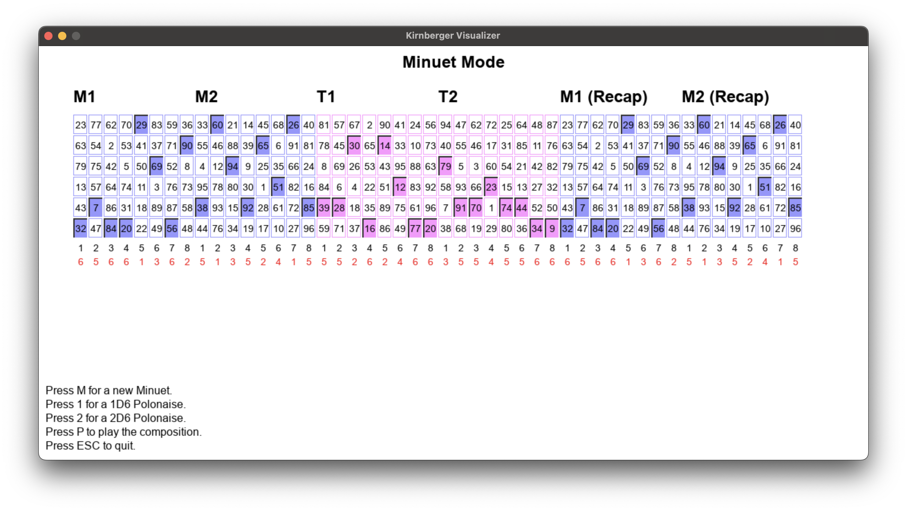

# Kirnberger Dice Composer
## A Recreation of Kirnberger's 1757 Music Generation System

---

This is an implementation of Johann Philipp Kirnberger's dice-based composition system from 1757, _Der allezeit fertige Polonoisen- und Menuettencomponist_ (Berlin: Georg Ludwig Winter). The code simulates the generation process and adds playback, visualization, and some elementary analysis features.

---

### Core Files

+ `kirnberger.py` -- Main program
+ `kirnberger_data.py` -- The generation tables from the original
+ `kirnberger_dice_utils.py` -- Module for dice roll management
+ `kirnberger_midi_utils.py` -- Module for MIDI handling
+ `kirnberger_visual_utils` -- GUI module

---

### Additional Code

+ `analyzer.py` -- Music analysis code
+ `data_integrity.py` -- Code that checks if all files are present

---

### Further Contents

+ `midi_m`, `midi_p`, `midi_t` -- MIDI data from minuet, polonaise, and trio sections
+ `source_m`, `source_p`, `source_t` -- Source files (MuseScore Studio 4.5)
+ `xml_m`, `xml_p`, `xml_t` -- MusicXML files
+ The `source` folder contains Kirnberger's original publication plus a transcription and translation of the preface

---

### Requirements

+ Python 3 with `matplotlip` and `numpy`, `mido` and `pretty_midi`, and `pygame`

---

### Sample Output

Generation Modes: 1D6 Polonaise, 2D6 Polonaise, Minuet

Note Frequencies for Groups 1 (D F# A) and 2 (A C# E)

Analysis of Most Likely Tonal Centers per Group

---

christoph.hust@hmt-leipzig.de