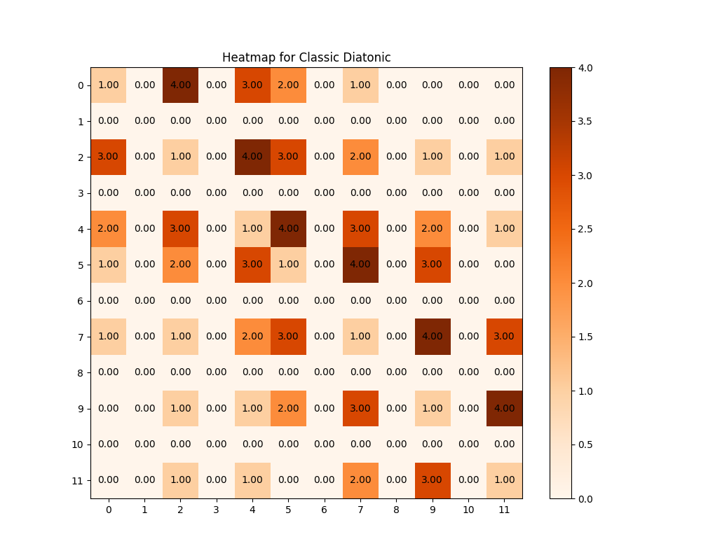
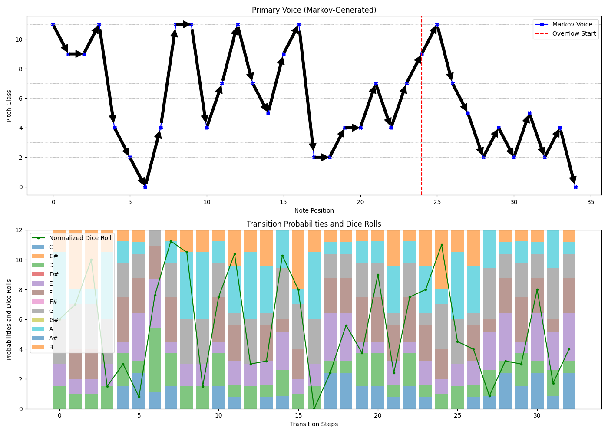

# Markov Chain Music Generator
## Two-part Music Construction in Python and C

---

This project uses a Markov process to generate short melodies and add a secondary voice. The whole thing is written in Python, with a preliminary version in C.

---

## Contents

- `markov.py` -- Program entry point (main routine)
- `adjacency_matrices.json` -- A collection of adjacency matrices (diatonic, chromatic, octatonic, etc.)
- `markov_constants.py` -- Constants for generation and file management
- `markov_music_generator.py` -- Core logic for music generation
- `counterpoint_generators.py` -- A bunch of methods for adding a second voice. None makes too much sense, but some are even worse than others.
- `output_generator.py` -- Text, audio, visual, and JSON output generation
- `matrix_visualizer.py` -- Visual and text output of transition matrices

---

## Markov Melody Generation

- Selection of predefined adjacency matrices
- Melody generation with final tonic resolution
- Logging of statistical information
- Visual representation of the generation output

---

### Counterpoint Options

- Fixed intervals (thirds)
- Random diatonic, chromatic, or octatonic notes
- Elementary rule-based method (still buggy)

---

## Audio Output and Samples

The code uses PyGame Mixer for audio output. This needs the necessary samples within the folder `samples/`! I took those samples from https://github.com/parisjava/wav-piano-sound -- thank you!

---

## Requirements

- Python 3
- `matplotlib`, `pygame`

Make sure the folder `samples/` contains WAV files named after pitch classes, e.g. `wav_c1.wav` etc.

---

## Sample Output

Adjacency Matrix Heatmap

Music Generation Statistics

---

## C Version

The Python code began as a translation exercise from an older and rudimentary C code. This code (`markov_music.c` and `adjacency_matrices.h`) is left in the `Original C version` folder.

---

Further references and commentaries within the codes.

christoph.hust@hmt-leipzig.de