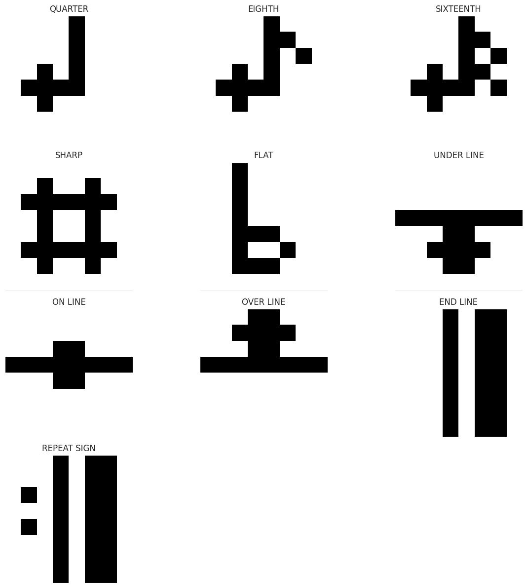
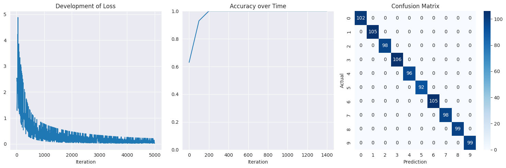
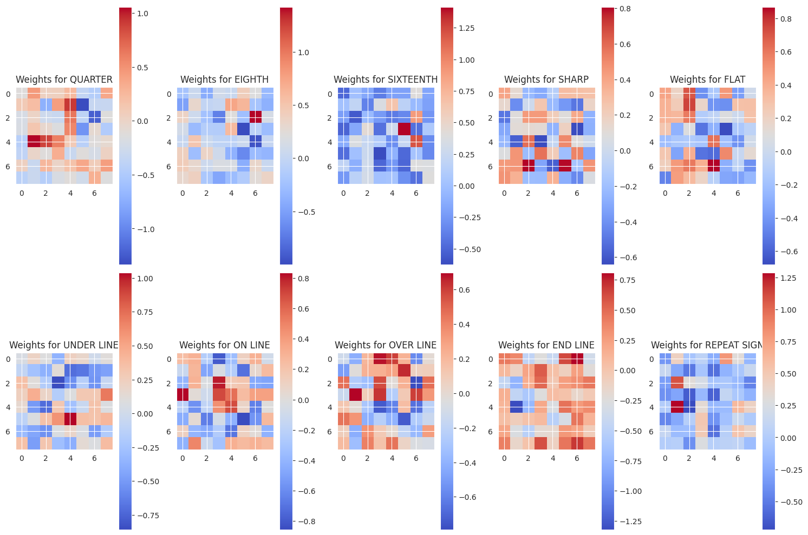
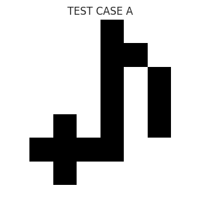
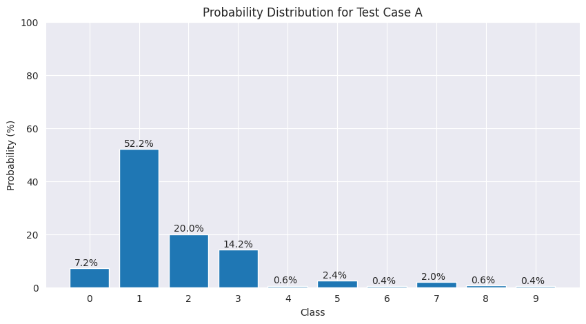
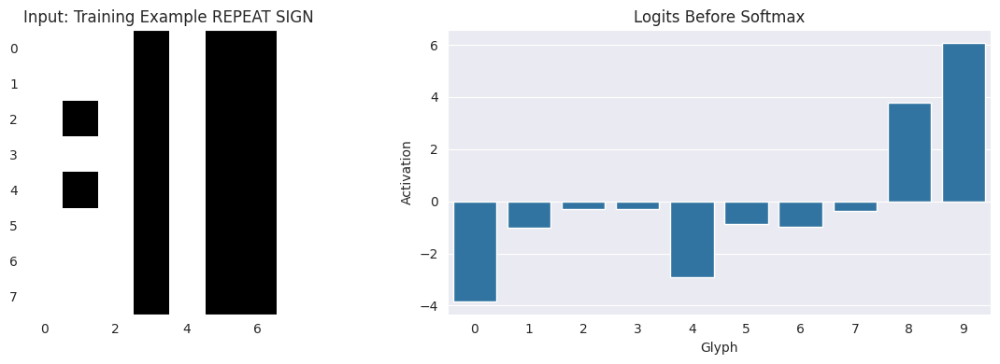
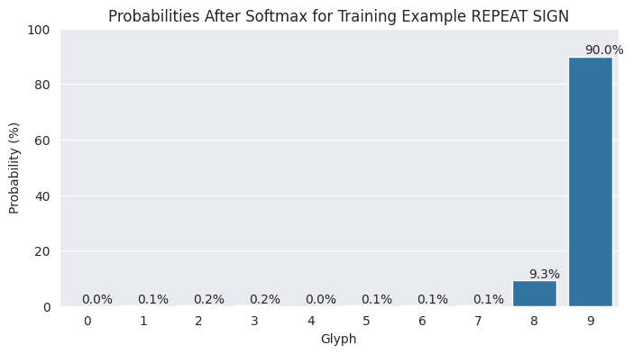
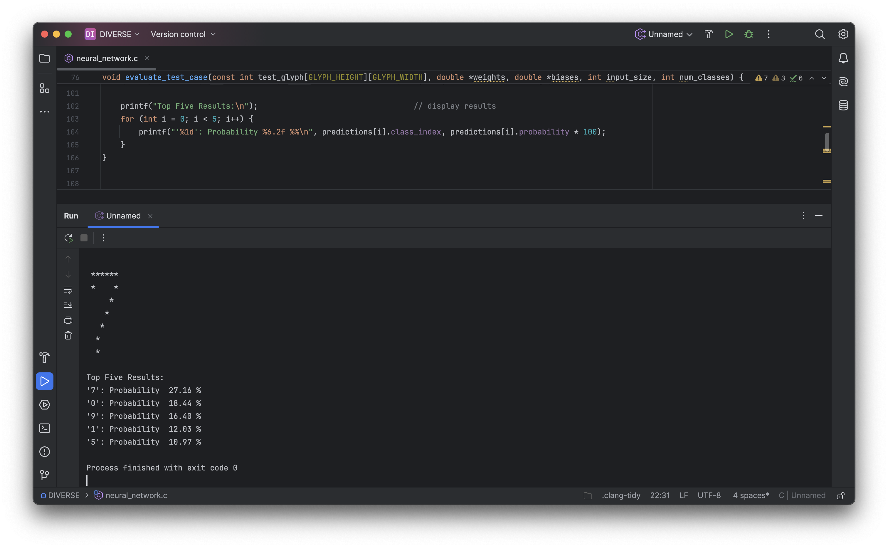

# Neural Network Playground
## Linear Classifier for Minimal OCR and OMR

---

This notebook implements a simple neural network in Python, capable of recognizing pre-defined glyphs (digits or music symbols) on an 8 x 8 pixel grid. Coming from an older seminar, it includes an extensive playground section at the end of the notebook. It is meant as an intro to Machine Learning fundamentals.

---

## How it works

Each 8 x 8 pixel glyph is flattened to 64 input features. One out of ten glyph classes is selected via softmax.

Glyphs are trained through supervised learning. Weights and biases are updated via gradient descent.

---

## Requirements

- Python 3 and Jupyter Notebook interface
- `numpy`, `matplotlib`, and `seaborn`

---

## Sample Output

Training Glyphs

Training Statistics

Input Glyph and Classification Statistics

Training Statistics: Logits versus Probabilities

---

## C Version

The first version of this was written in C and is contained in the `C code` folder. `neural_network.c` is the code itself, `glyph_definitions.h` provides the data.

---

There is really extensive commentary in the MD cells.

christoph.hust@hmt-leipzig.de