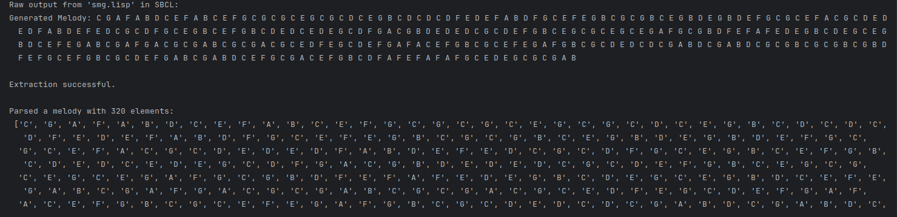
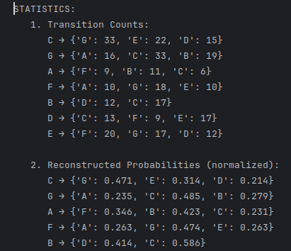
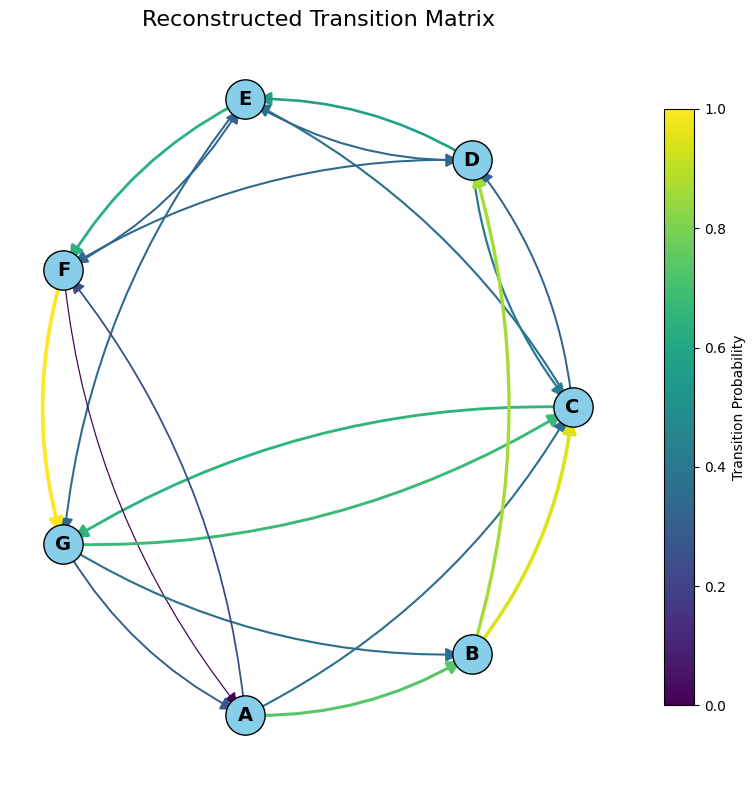

# Stochastic Music Generation
## Another Markov Chain Experiment in Common Lisp

---

This code features a very simple system for stochastic music generation using a Markov chain, written in Common Lisp (SBCL). It is vaguely inspired by some early approaches to algorithmic composition.

The goal is to give some insight into stochastic AI, namely Markov chain generation of music. A Python/Jupyter Notebook wrapper adds some statistics, reconstructing the actual tone distribution in generated outputs in comparison to the source matrix, and visualizing the output's structure.

---

## Structure

- `smg.lisp` – Common Lisp file with a diatonic note set in C major, a sample transition matrix, a "melody" generator using the Markov algorithm, and just enough I/O to run this independently.
- `LISPwrapper.ipynb` – Python notebook frontend that runs the LISP system and imports its output, calculates statistics, and visualizes the transition matrix from the actual output.

---

## Functionality

### Lisp

+ Definition of transition rules
+ Weighted transition matrix
+ Markov chain for melody generation
+ Super-easy output
+ Added a 1:1 Py translation for documentation

### Notebook

+ Interaction with SBCL
+ Frequency analysis and probability visualization

---

## Markov Data

Other than in my second Markov implementation, I tried to go rather for tonal bass lines in this code. Hence the connections from C – G – C, F – G, G – A, the missing G – F connection, and so on. However, this was written down without too much thought and might be revised.

Another way to move forwards might be a Gregorian chant simulator, maybe involving different generation matrices for the initial ascent, the reciting / caesura, and the final descent.

---

## Requirements

+ SBCL (Steel Bank Common Lisp)
+ Python 3 with `matplotlib` and `networkx`

---

## Sample Output

Markov Generation

Transition Counts and Probability Distribution

Visualization of Occurring Transitions

---

## Literature on Markov chains

+ James R. Norris, _Markov Chains_, Cambridge, etc: Cambridge University Press, 1998 (Cambridge Series in Statistical and Probabilistic Mathematics, 2)
+ Nicolas Privault, _Understanding Markov Chains: Examples and Applications_, Singapore: Springer 2013, 2nd ed., 2018

Both are far more advanced than what I do, and I didn't read beyond the introductory chapters in both cases – which already brought more than I needed for the code.

---

## Literature on LISP

I recall having looked into Peter Norvig's _Paradigms of Artificial Intelligence Programming: Case Studies in Common Lisp_ (which was brand-new back then) during a brief phase when I brushed up coding while studying at university. This is even available on GitHub now: https://norvig.github.io/paip-lisp/#/?id=paradigms-of-artificial-intelligence-programming

What (little) more I know about LISP in addition to the basic functionality introduced in an Introduction to Computer Linguistics seminar in the mid-1990s is from these books:

+ Holger Kastrop: "Symbolische Datenverarbeitung mit LISP", in: _Einführung in die Künstliche Intelligenz_, ed. by Manfred Stede, vol. 2, _Anwendungsgebiete_, Sprendlingen: Luther, 1984, pp. 140-169
+ A. A. Berk, _LISP: The Language of Artificial Intelligence_, New York: van Nostrand Reinhold, 1985
+ A. Bundy: _Praktische Einführung in die Künstliche Intelligenz. Mit Programmbeispielen in LOGO und LISP_, Munich: ITW, 1986

and, mostly:

+ Conrad Barski, _Land of LISP: Learn to Program in LISP, One Game at a Time!_, San Francisco: no starch press, 2011

---

Further info and literature in the inline code comments.

christoph.hust@hmt-leipzig.de