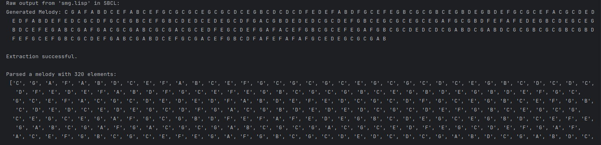
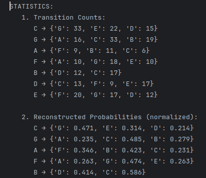
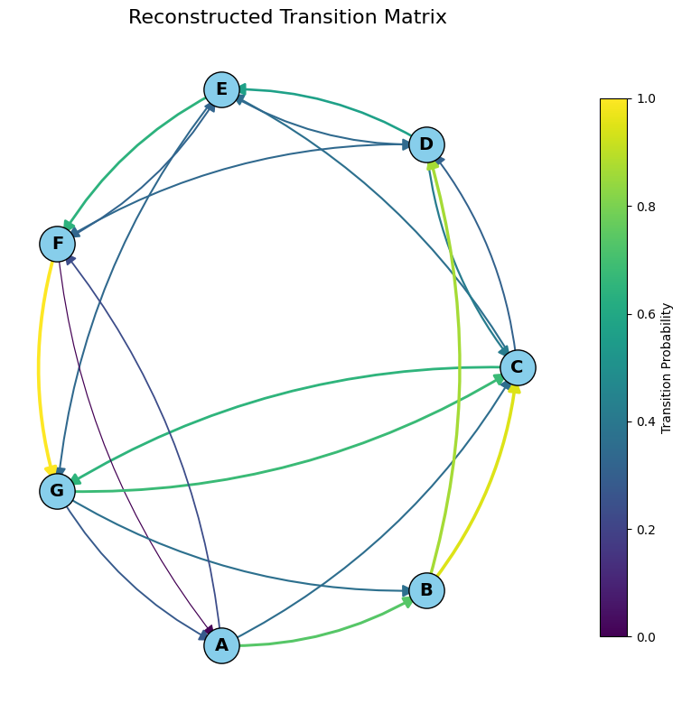

# Stochastic Music Generation
## Another Markov Chain Experiment in Common Lisp

---

This code features a very simple system for stochastic music generation using a Markov chain, written in Common Lisp (SBCL). It is vaguely inspired by some early approaches to algorithmic composition.

The goal is to give some insight into stochastic AI, namely Markov chain generation of music. A Python/Jupyter Notebook wrapper adds some statistics, reconstructing the actual tone distribution in generated outputs in comparison to the source matrix, and visualizing the output's structure.

---

## Structure

- `smg.lisp` – Common Lisp file with a diatonic note set in C major, a sample transition matrix, a "melody" generator using the Markov algorithm, and just enough I/O to run this independently.
- `LISPwrapper.ipynb` – Python notebook frontend that runs the LISP system and imports its output, calculates statistics, and visualizes the transition matrix from the actual output.

---

## Functionality

### Lisp

- Definition of transition rules
- Weighted transition matrix
- Markov chain for melody generation
- Super-easy output

### Notebook

- Interaction with SBCL
- Frequency analysis and probability visualization

---

## Requirements

- SBCL (Steel Bank Common Lisp)
- Python 3 with `matplotlib` and `networkx`

---

## Sample Output

Markov Generation

Transition Counts and Probability Distribution

Visualization of Occurring Transitions

---

## Literature on Markov chains

+ James R. Norris, _Markov Chains_, Cambridge, etc: Cambridge University Press, 1998 (Cambridge Series in Statistical and Probabilistic Mathematics, 2)
+ Nicolas Privault, _Understanding Markov Chains: Examples and Applications_, Singapore: Springer 2013, 2nd ed., 2018

---

Further info and literature in the inline code comments.

christoph.hust@hmt-leipzig.de